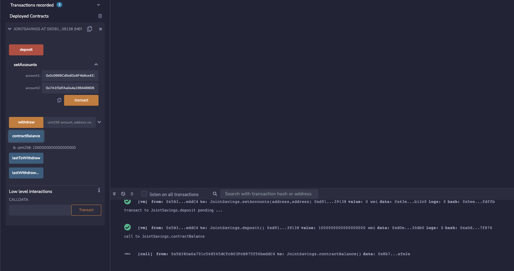
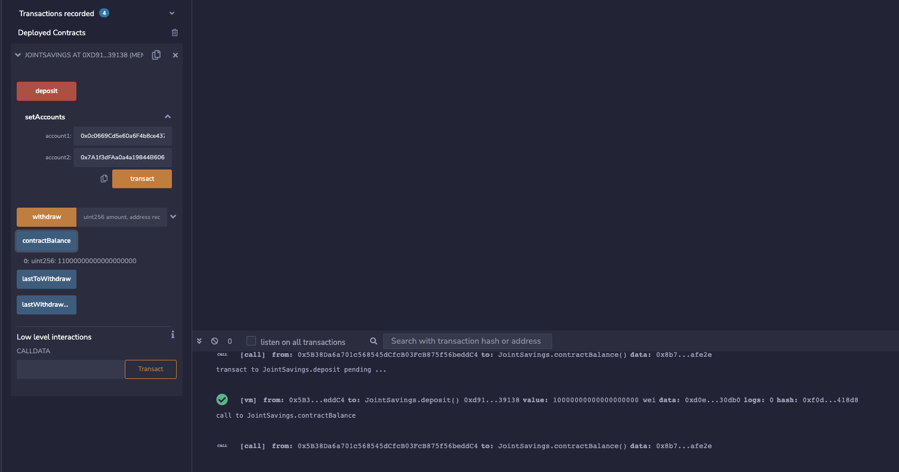
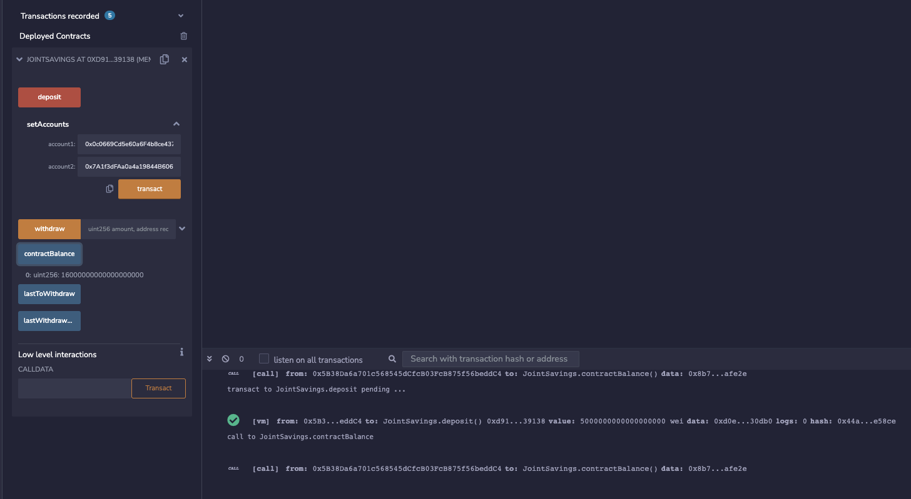
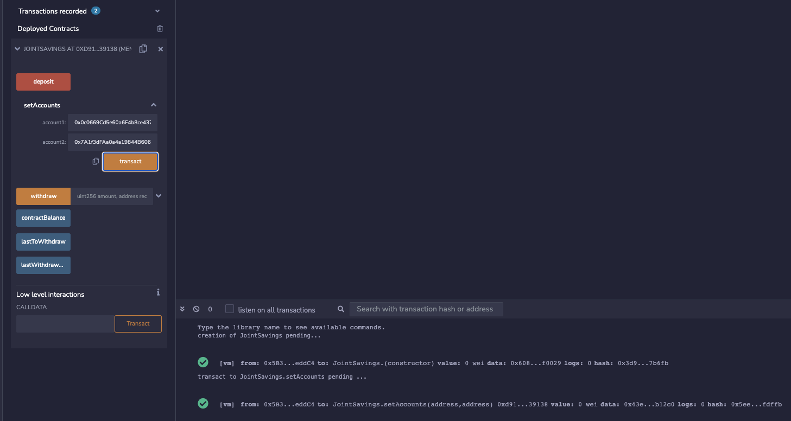
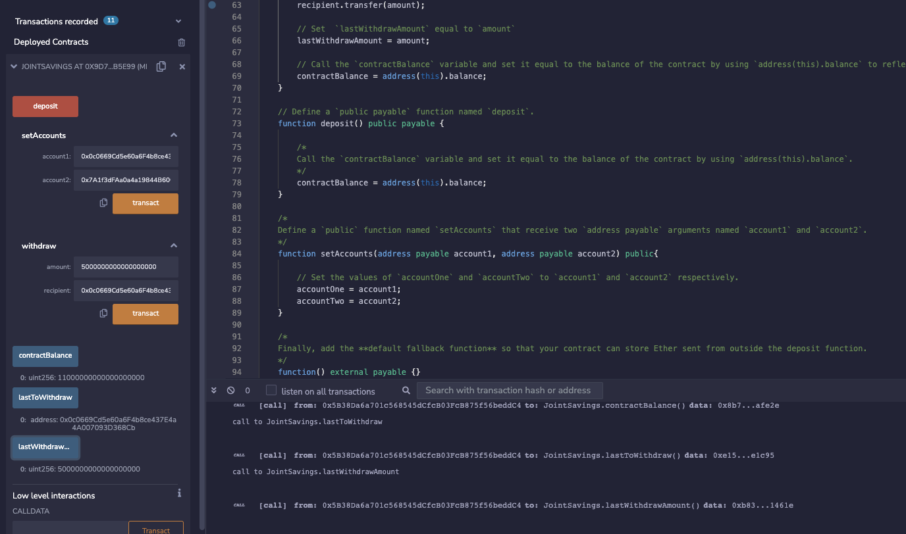
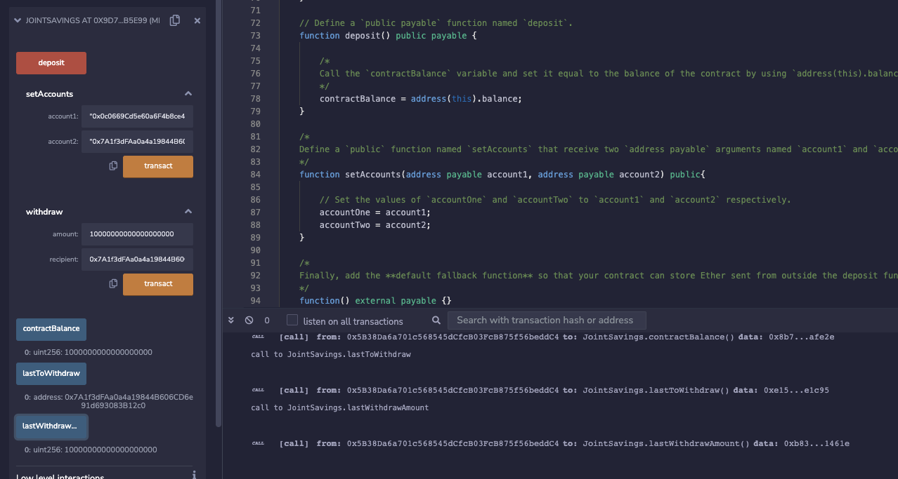

# Challenge 20 | Smart Contracts | Solidity

The purpose of this assignment is to build a smart contract for a fictious fintech startup. This smart contract automates the creation of joint savings accounts for two user addresses. It uses Ether management functions to implement the financial institution’s requirements for a joint savings account. These features will consist of the ability to deposit and withdraw funds from the account.

---

## Technologies

```
This program uses Solidity and Ethereum Virtual Machine.
```

---

## Screenshots







